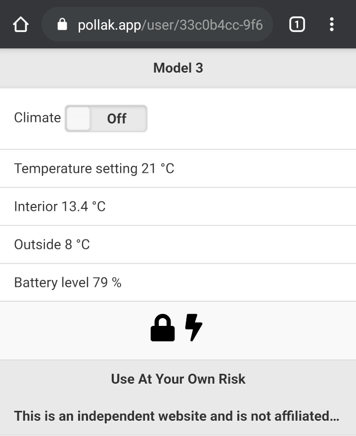

# pollak

Grant someone a temporary access to your Tesla vehicle.

https://pollak.app



## How to run a local test server

```
pip3 install -r requirements.txt
export SECRET_KEY=$(python3 -c 'import secrets; print(secrets.token_hex(16))')
# Temporary database entirely in-memory
SKIP_DATABASE_CONNECTION=true python3 main.py
```

## How to run on Google Cloud Platform

### Firestore

1. [Go to the Cloud Firestore viewer](https://console.cloud.google.com/firestore/data).
2. From the `Select a database service` screen, choose *Cloud Firestore in Native mode*.
3. Select a location for your Cloud Firestore.
4. Click `Create Database`.

More information at https://cloud.google.com/firestore/docs/quickstart-servers

### Secret Manager

0. Generate `SECRET_KEY` with the following command `python3 -c 'import secrets; print(secrets.token_hex(16))'`
1. Go to the [**Secret Manager**](https://console.cloud.google.com/security/secret-manager) page in the Cloud Console.
2. On the **Secret Manager page,** click **Create Secret**.
3. On the **Create secret** page, under **Name**, enter `GAE_SECRET_KEY`.
4. In the **Secret value** field, enter previously generated `SECRET_KEY`.
5. Leave the **Regions** section unchanged.
6. Click the **Create secret** button.

If you're using reCAPTCHA, repeat the previous steps except set the secret name to `RECAPTCHA_SITE_SECRET` and the value to your reCAPTCHA *site secret*.

More information at https://cloud.google.com/secret-manager/docs/creating-and-accessing-secrets

### App Engine

This application requires that the App Engine service account has the following [IAM](https://console.cloud.google.com/iam-admin/) roles:

1. **Cloud Datastore User**
2. **Secret Manager Secret Accessor**
3. **Logs Writer**

By default, the App Engine default service account has the **Editor** role in the project, which has all the needed permissions.

Edit [app.yaml](app.yaml) and replace `RECAPTCHA_SITE_KEY` with your reCAPTCHA `site key` or remove the variable if you're not using reCAPTCHA.

Everything set. Run `gcloud app deploy`
